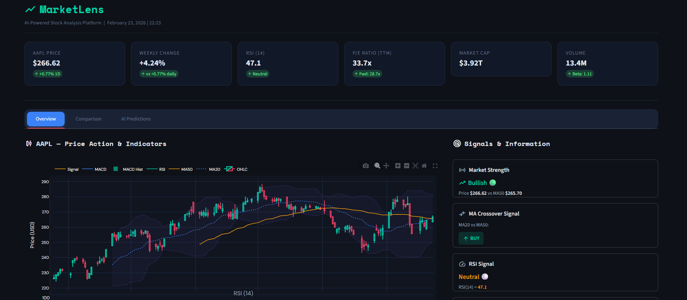
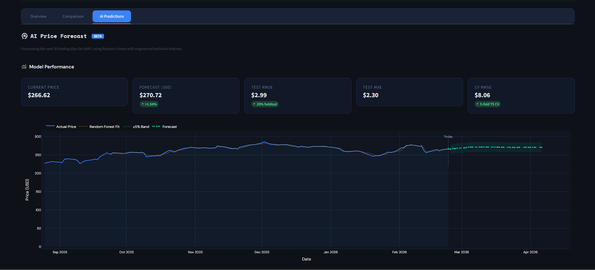

<div align="center">

# MarketLens

### AI-Powered Stock Market Analysis Platform

[](https://python.org)
[](https://streamlit.io)
[](https://scikit-learn.org)

A professional, dark-themed stock market dashboard that combines real-time market data, technical analysis, multi-stock comparison, and machine learning price forecasting in a single unified interface.
<table>
<tr>

<td align="center" width="16%">
<br>
<b>Streamlit</b><br>
<sub>UI Framework</sub>
</td>

<td align="center" width="16%">
<br>
<b>Pandas</b><br>
<sub>Data Processing</sub>
</td>

<td align="center" width="16%">
<br>
<b>Plotly</b><br>
<sub>Visualization</sub>
</td>

<td align="center" width="16%">
<br>
<b>scikit-learn</b><br>
<sub>Machine Learning</sub>
</td>

<td align="center" width="16%">
<br>
<b>NumPy</b><br>
<sub>Computation</sub>
</td>

<td align="center" width="16%">
<br>
<b>yfinance</b><br>
<sub>Market Data</sub>
</td>

</tr>
</table>

---

</div>

## ✨ Features

<table>
<tr>
<td width="33%">

### Overview Tab

- Interactive candlestick charts with OHLCV data
- Technical overlays (Bollinger Bands, MA20/50/200)
- RSI gauge with signal classification
- MACD analysis with histogram breakdown
- Live trading signals (BUY/SELL/HOLD)
- Market strength & 52-week range tracker
- Company profile & latest news

</td>
<td width="33%">

### Comparison Tab

- Normalized performance charts (base 100)
- Comprehensive performance metrics table
- Return ranking visualization
- Pearson correlation heatmap
- Multi-timeframe analysis
- CSV data export

</td>
<td width="33%">

### AI Predictions Tab

- ML price forecasting (RF, GB, LR)
- 10-60 day configurable horizon
- Confidence bands visualization
- Feature importance analysis
- Model evaluation metrics
- Forecast schedule & CSV export

</td>
</tr>
</table>

---
##  Screenshots

### Dashboard


### Comparision


### Prediction View



## Usage

###  Control Panel

| Control            | Description                         | Options                  |
|--------------------|-------------------------------------|--------------------------|
| Stock Selection    | Choose stocks for analysis          | Up to 10 stocks          |
| Primary Stock      | Main stock for detailed view        | From selected            |
| Time Period        | Historical data window              | 6M, 1Y, 2Y, 5Y           |
| Forecast Days      | Prediction horizon                  | 10 – 60 days             |
| Bollinger Bands    | Chart overlay                       | On / Off                 |
### Signal Interpretation

| Signal            | Condition                      | Meaning                |
|-------------------|--------------------------------|------------------------|
| 🟢 BUY            | MA20 crosses above MA50        | Bullish momentum       |
| 🔴 SELL           | MA20 crosses below MA50        | Bearish momentum       |
| 🟡 HOLD           | No crossover                   | Neutral trend          |
| 🔴 Overbought     | RSI > 70                       | Potential reversal     |
| 🟢 Oversold       | RSI < 30                       | Potential reversal     |
### Tech Stack

| Component   | Technology           | Purpose                     |
|-------------|----------------------|-----------------------------|
| UI          | Streamlit            | Web dashboard               |
| Data        | yfinance             | Yahoo Finance API           |
| Charts      | Plotly               | Interactive visualization   |
| ML          | scikit-learn         | Price prediction            |
| Processing  | Pandas, NumPy        | Data manipulation           |
| Icons       | Google Material Symbols | UI iconography           |
### Technical Indicators

| Indicator        | Parameters              | Usage                              |
|------------------|-------------------------|------------------------------------|
| SMA              | 20, 50, 200             | Trend direction & crossovers       |
| RSI              | 14 periods              | Overbought / Oversold detection    |
| MACD             | 12 / 26 / 9 EMA         | Momentum confirmation              |
| Bollinger Bands  | 20 periods, 2σ          | Volatility & price channels        |

---

## Installation

### Prerequisites

- Python 3.9 or higher
- pip package manager
- Git

### Quick Start

```bash
# Clone the repository
git clone https://github.com/your-username/marketlens.git
cd marketlens

# Create virtual environment
python -m venv .venv

# Activate virtual environment
source .venv/bin/activate      # macOS / Linux
.venv\Scripts\activate         # Windows

# Install dependencies
pip install -r requirements.txt

# Launch the application
streamlit run app.py
